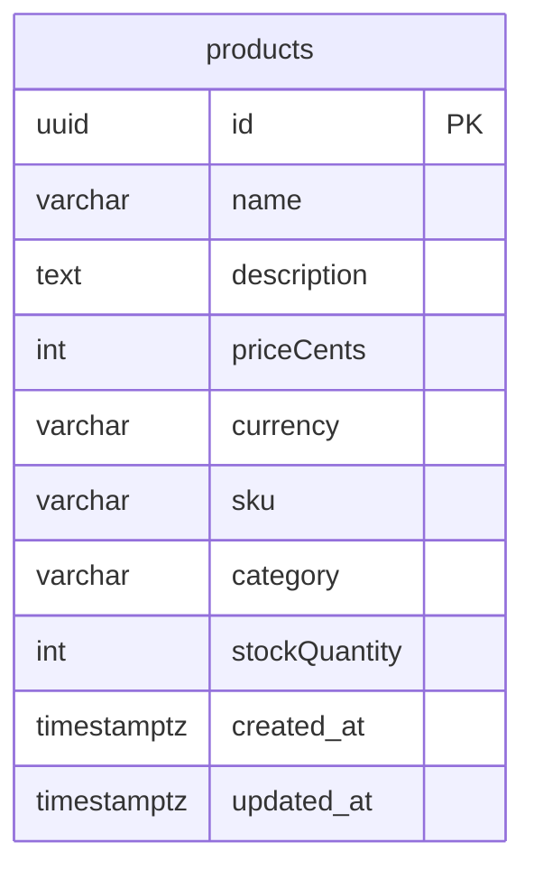

# Data Model — ecom-product-catalog

> Documento vivo do modelo de dados. Atualizado sempre que uma entidade for criada, alterada ou removida.
> **Ultima atualizacao:** 2026-06-16

---

## Indice

- [Visao Geral](#visao-geral)
- [Diagrama ER](#diagrama-er)
- [Entidades](#entidades)
- [Enums e Dominio de Valores](#enums-e-dominio-de-valores)
- [Indices e Performance](#indices-e-performance)
- [Classificacao de Privacidade](#classificacao-de-privacidade)
- [Decisoes de Modelagem](#decisoes-de-modelagem)

---

## Visao Geral

O modelo de dados do Product Catalog e composto por uma unica entidade principal (`products`) que armazena todos os atributos do produto, incluindo precificacao via Value Object `Money` mapeado em duas colunas (`priceCents` e `currency`). Nao ha relacionamentos com outras entidades — o servico e a fonte unica da verdade (source of truth) para dados de produto.

**Banco de dados:** PostgreSQL 15
**ORM / acesso:** TypeORM 0.3
**Extensoes relevantes:** pgcrypto (`gen_random_uuid()`)

---

## Diagrama ER

> Entidade unica. O Value Object `Money` e representado pelas colunas `priceCents` + `currency`.

---

## Entidades

---

### Product

> Entidade central do dominio de catalogo. Representa um produto com nome, descricao, precificacao, SKU unico, categoria e quantidade em estoque.

**Tabela:** `products`
**Servico responsavel:** ecom-product-catalog

| Campo | Tipo SQL | Nullable | Default | Descricao |
|-------|----------|----------|---------|-----------|
| `id` | UUID | Nao | `gen_random_uuid()` | Identificador unico do produto |
| `name` | VARCHAR(255) | Nao | — | Nome do produto |
| `description` | TEXT | Nao | — | Descricao detalhada do produto |
| `priceCents` | INTEGER | Nao | — | Preco em centavos (componente do Value Object Money) |
| `currency` | VARCHAR(3) | Nao | `'BRL'` | Moeda ISO 3 letras (componente do Value Object Money) |
| `sku` | VARCHAR(100) | Nao | — | SKU unico do produto (Stock Keeping Unit) |
| `category` | VARCHAR(100) | Nao | — | Categoria do produto |
| `stockQuantity` | INTEGER | Nao | — | Quantidade em estoque |
| `createdAt` | TIMESTAMP | Nao | `NOW()` | Data de criacao do registro |
| `updatedAt` | TIMESTAMP | Nao | `NOW()` | Data da ultima atualizacao |

**Constraints:**
- `PRIMARY KEY (id)` — identificador unico via UUID
- `UNIQUE (sku)` — garante que nao haja duplicidade de SKU
- `CHECK (priceCents >= 0)` — preco nao pode ser negativo (validado pelo Value Object Money e pelo DTO)

**Relacionamentos:**
- Nenhum. A entidade `Product` nao possui chaves estrangeiras. E uma entidade raiz (aggregate root) independente.

---

## Enums e Dominio de Valores

Nao ha enums no banco de dados. O campo `currency` aceita qualquer codigo ISO 4217 de 3 letras validado pelo Value Object `Money`.

### Moedas suportadas (exemplos)

Usado em: `products.currency`

| Valor | Significado |
|-------|-------------|
| `BRL` | Real brasileiro (padrao) |
| `USD` | Dolar americano |
| `EUR` | Euro |

> Qualquer codigo ISO 4217 de 3 letras e aceito. O valor padrao no banco e `BRL`.

---

## Indices e Performance

| Indice | Tabela | Campos | Tipo | Motivo |
|--------|--------|--------|------|--------|
| `PK_products` | `products` | `id` | BTREE (PK implicito) | Busca por ID |
| `UQ_products_sku` | `products` | `sku` | BTREE (UNIQUE implicito) | Consulta por SKU no `CreateProductUseCase` |
| — | `products` | `category` | — | Filtro por categoria atualmente sem indice explicito; recomendado se houver volume significativo |

---

## Classificacao de Privacidade

> Todos os campos sao de natureza comercial e podem ser expostos via API publica / protegida.

| Campo | Tabela | Classificacao | Justificativa |
|-------|--------|---------------|---------------|
| `name` | `products` | Publico derivado | Nome do produto |
| `description` | `products` | Publico derivado | Descricao do produto |
| `priceCents` | `products` | Publico derivado | Preco do produto |
| `currency` | `products` | Publico derivado | Moeda do preco |
| `sku` | `products` | Publico derivado | Codigo de identificacao do produto |
| `category` | `products` | Publico derivado | Categoria do produto |
| `stockQuantity` | `products` | Publico derivado | Quantidade em estoque |

**Regras gerais:**
- Campos marcados como **Publico derivado** podem aparecer em respostas de API

---

## Decisoes de Modelagem

### ADR-DM-001 — Preco armazenado como inteiro (centavos)

| Campo | Detalhe |
|-------|---------|
| **Status** | Aceita |
| **Data** | 2026-06-16 |
| **Contexto** | Precos em reais decimais (ex: 199.90) sofrem de problemas de arredondamento com FLOAT e de overhead de string com DECIMAL/NUMERIC |
| **Decisao** | Armazenar `priceCents` como INTEGER (centavos) separado de `currency` como VARCHAR(3). O Value Object `Money` no dominio encapsula a logica de criacao, validacao e conversao |
| **Alternativas consideradas** | NUMERIC(10,2) no banco com tratamento de arredondamento na aplicacao; FLOAT — descartado por imprecisao |
| **Consequencias** | Consultas com filtro de preco exigem conversao para centavos no front/API; ganho de precisao e performance nas comparacoes |

### ADR-DM-002 — UUID como PK em vez de SERIAL

| Campo | Detalhe |
|-------|---------|
| **Status** | Aceita |
| **Data** | 2026-06-16 |
| **Contexto** | Em arquitetura de microservicos, IDs expostos via API nao devem sequenciais para evitar enumeracao de recursos |
| **Decisao** | Usar UUID como primary key com `gen_random_uuid()` como default |
| **Alternativas consideradas** | SERIAL (auto-incremento) — descartado por seguranca e por nao ser adequado para eventos distribuidos |
| **Consequencias** | PK com 16 bytes vs 4 bytes do SERIAL; indices BTREE levemente maiores; sem necessidade de sequencia centralizada |
