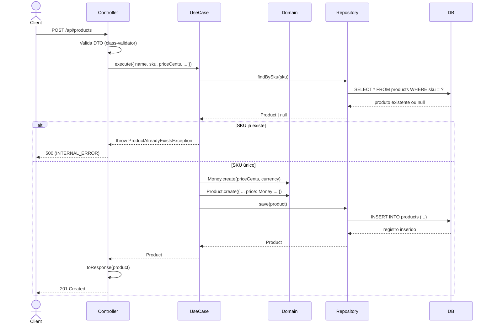

# System Feature Flows

> Registro histórico e incremental dos fluxos internos de cada funcionalidade.
> Este documento cresce a cada nova feature implementada e **nunca tem seções removidas**.

---

## Índice

- [Visão Geral da Arquitetura](#visão-geral-da-arquitetura)
- [Convenções deste Documento](#convenções-deste-documento)
- [Feature: CRUD de Produtos](#feature-crud-de-produtos)
- [Feature: Value Object Money](#feature-value-object-money)

---

## Visão Geral da Arquitetura

**Padrão arquitetural:** Clean Architecture

**Fluxo global de uma requisição:**

```
HTTP Request
    └── Controller (Presentation / Interfaces)
            └── Use Case (Application)
                    ├── Domain Entity / Value Object
                    └── Repository Port (Application)
                              └── Repository Impl (Infrastructure)
                                        └── TypeORM / PostgreSQL
```

**Camadas e responsabilidades:**

| Camada | Responsabilidade |
|--------|------------------|
| `interfaces` (presentation) | Receber requisições, validar DTOs com class-validator, formatar resposta |
| `application` | Orquestrar o caso de uso, coordenar domínio e repositório via porta |
| `core` (domain) | Regras de negócio puras — entidade `Product`, Value Object `Money`, exceções de domínio |
| `infrastructure` | Persistência com TypeORM, migrations, implementação concreta dos repositórios |

---

## Convenções deste Documento

- **Erros de domínio** são lançados como exceções tipadas (`ProductNotFoundException`, `ProductAlreadyExistsException`, `InvalidMoneyException`)
- **Erros de infra** são capturados pelo `AllExceptionsFilter` global e retornados no envelope padronizado
- **DTOs** trafegam entre interface ↔ application; **Entidades** entre application ↔ domain
- **Validação** ocorre em dois níveis: class-validator no controller e invariantes no domínio

---

---

# Feature: CRUD de Produtos

> **Versão:** 1.0.0
> **Implementada em:** 2026-06-16
> **Status:** Concluída

---

## Resumo

API REST completa para gerenciar o catálogo de produtos: criar, listar (com filtro por categoria), buscar por ID, atualizar e remover produtos. É a feature central do serviço, servindo como fonte única da verdade para os demais microserviços do ecossistema.

**Motivação:** Necessidade de um serviço dedicado e desacoplado para gestão de produtos, substituindo o CRUD embutido em um monolito.
**Resultado:** Serviço independente com contrato REST claro, validação em duas camadas e persistência via TypeORM + PostgreSQL.

---

## Fluxo Principal — Criação de Produto

### 1. Ponto de Entrada

- **Tipo:** HTTP REST
- **Arquivo:** `src/interfaces/controllers/product.controller.ts`
- **Rota/Evento:** `POST /api/products`
- **Autenticação:** Nenhuma (pública)

O controller recebe o payload JSON, valida o DTO com class-validator e delega ao `CreateProductUseCase`.

---

### 2. Validação de Entrada

- **Arquivo:** `src/interfaces/dtos/create-product.dto.ts`
- **Biblioteca:** class-validator

| Campo | Tipo | Obrigatório | Regra de validação |
|-------|------|-------------|---------------------|
| `name` | string | Sim | `@MaxLength(255)` |
| `description` | string | Sim | — |
| `priceCents` | number | Sim | `@IsInt()`, `@Min(0)` |
| `currency` | string | Não | `@IsOptional()`, `@IsString()` (default `BRL`) |
| `sku` | string | Sim | `@MaxLength(100)` |
| `category` | string | Sim | `@MaxLength(100)` |
| `stockQuantity` | number | Sim | `@IsInt()`, `@Min(0)` |

**Falha de validação:** retorna `400 Bad Request` com o envelope de erro padronizado contendo as mensagens do class-validator.

---

### 3. Orquestração da Aplicação

- **Arquivo:** `src/application/use-cases/create-product.usecase.ts`

1. Verifica unicidade do SKU via `repository.findBySku(sku)` — se existir, lança `ProductAlreadyExistsException`
2. Cria o Value Object `Money` com `priceCents` e `currency`
3. Cria a entidade `Product` via `Product.create()` com os dados validados
4. Persiste o produto via `repository.save(product)`
5. Retorna a entidade `Product` criada

---

### 4. Regras de Negócio

| Regra | Descrição | Localização no Código |
|-------|-----------|----------------------|
| SKU único | Não pode haver dois produtos com o mesmo SKU | `src/application/use-cases/create-product.usecase.ts:20-22` |
| Preço não negativo | `priceCents` deve ser inteiro >= 0 | `src/core/value-objects/money.vo.ts:8-12` |
| Moeda 3 letras | `currency` deve ser código ISO 4217 de 3 caracteres | `src/core/value-objects/money.vo.ts:14-16` |

---

### 5. Persistência / Integrações

**Repositórios utilizados:**

| Repository | Operação | Arquivo |
|------------|----------|---------|
| `ProductRepository` (port) | `findBySku` + `save` | `src/application/ports/product-repository.port.ts` |
| `ProductRepositoryImpl` | Implementação concreta TypeORM | `src/infrastructure/persistence/repositories/product.repository.ts` |

**Integrações externas:** Nenhuma.

---

### 6. Resposta Final

**Sucesso — `201 Created`:**

```json
{
  "id": "uuid-do-produto",
  "name": "Notebook Dell",
  "description": "Dell Inspiron 15",
  "priceCents": 450000,
  "currency": "BRL",
  "price": 4500,
  "sku": "NOTE-001",
  "category": "Eletronicos",
  "stockQuantity": 10,
  "createdAt": "2026-06-16T10:00:00.000Z",
  "updatedAt": "2026-06-16T10:00:00.000Z"
}
```

**Campos retornados:**

| Campo | Tipo | Descrição |
|-------|------|-----------|
| `id` | string | UUID do produto |
| `name` | string | Nome |
| `description` | string | Descrição |
| `priceCents` | number | Preço em centavos |
| `currency` | string | Moeda ISO 3 letras |
| `price` | number | Preço convertido para reais (centavos / 100) |
| `sku` | string | SKU único |
| `category` | string | Categoria |
| `stockQuantity` | number | Quantidade em estoque |
| `createdAt` | string | Data de criação (ISO 8601) |
| `updatedAt` | string | Data de atualização (ISO 8601) |

---

## Fluxo Principal — Listagem de Produtos

### 1. Ponto de Entrada

- **Arquivo:** `src/interfaces/controllers/product.controller.ts`
- **Rota/Evento:** `GET /api/products?category=Eletronicos`
- **Autenticação:** Nenhuma (pública)

O controller extrai o query param opcional `category` e repassa ao `ListProductsUseCase`.

### 2. Orquestração

- **Arquivo:** `src/application/use-cases/list-products.usecase.ts`

1. Recebe `ListProductsInput` opcional com `{ category?: string }`
2. Chama `repository.findAll(filters)` que aplica filtro WHERE se `category` for informada
3. Retorna array de produtos mapeados para o formato de resposta

### 3. Resposta Final

**Sucesso — `200 OK`:**
```json
[
  {
    "id": "uuid",
    "name": "Notebook Dell",
    "priceCents": 450000,
    "price": 4500,
    "sku": "NOTE-001",
    "category": "Eletronicos",
    "stockQuantity": 10,
    "createdAt": "...",
    "updatedAt": "..."
  }
]
```

---

## Fluxo Principal — Busca por ID

### 1. Ponto de Entrada

- **Arquivo:** `src/interfaces/controllers/product.controller.ts`
- **Rota/Evento:** `GET /api/products/:id`
- **Autenticação:** Nenhuma (pública)

O parâmetro `:id` é validado com `ParseUUIDPipe` do NestJS.

### 2. Orquestração

- **Arquivo:** `src/interfaces/controllers/product.controller.ts:50-56`

O controller reutiliza o `ListProductsUseCase` sem filtro e filtra o resultado por ID em memória. Se não encontrado, retorna `{ message: 'Product not found' }` com status `200` (comportamento a ser refinado).

---

## Fluxo Principal — Atualização de Produto

### 1. Ponto de Entrada

- **Arquivo:** `src/interfaces/controllers/product.controller.ts`
- **Rota/Evento:** `PUT /api/products/:id`
- **Autenticação:** Nenhuma (pública)

### 2. Validação de Entrada

- **Arquivo:** `src/interfaces/dtos/update-product.dto.ts`

Todos os campos são opcionais (partial update). A validação segue as mesmas regras do DTO de criação, porém com `@IsOptional()`.

### 3. Orquestração

- **Arquivo:** `src/application/use-cases/update-product.usecase.ts`

1. Busca produto por ID via `repository.findById(id)` — se não existir, lança `ProductNotFoundException`
2. Converte `priceCents` + `currency` para `Money` (se `priceCents` for informado) na entidade
3. Chama `product.update(data)` que altera apenas os campos fornecidos e atualiza `updatedAt`
4. Persiste via `repository.save(product)`
5. Retorna a entidade atualizada

### 4. Resposta Final

**Sucesso — `200 OK`:**
```json
{
  "id": "uuid",
  "name": "Notebook Dell Atualizado",
  "priceCents": 500000,
  "price": 5000,
  "sku": "NOTE-001",
  "category": "Eletronicos",
  "stockQuantity": 8,
  "updatedAt": "2026-06-16T12:00:00.000Z"
}
```

---

## Fluxo Principal — Remoção de Produto

### 1. Ponto de Entrada

- **Arquivo:** `src/interfaces/controllers/product.controller.ts`
- **Rota/Evento:** `DELETE /api/products/:id`
- **Autenticação:** Nenhuma (pública)

### 2. Orquestração

- **Arquivo:** `src/application/use-cases/delete-product.usecase.ts`

1. Busca produto por ID — se não existir, lança `ProductNotFoundException`
2. Chama `repository.delete(id)`

### 3. Resposta Final

**Sucesso — `204 No Content`:** Corpo vazio.

---

## Fluxos Alternativos e Erros

| Cenário | HTTP Status | Código de Erro | Mensagem |
|---------|-------------|----------------|----------|
| SKU duplicado no create | 500 (INTERNAL_SERVER_ERROR) | `INTERNAL_ERROR` | `Product with SKU XXX already exists` |
| Produto não encontrado (update) | 500 | `INTERNAL_ERROR` | `Product with id XXX not found` |
| Produto não encontrado (delete) | 500 | `INTERNAL_ERROR` | `Product with id XXX not found` |
| Validação de DTO inválida | 400 | `VALIDATION_ERROR` | Mensagens do class-validator |
| UUID inválido no parâmetro | 400 | `VALIDATION_ERROR` | `Validation failed (uuid is expected)` |
| Erro interno inesperado | 500 | `INTERNAL_ERROR` | `Internal server error` |

> Todos os erros retornam o mesmo envelope:
> ```json
> {
>   "data": null,
>   "error": { "code": "ERROR_CODE", "message": "...", "details": {} },
>   "meta": { "requestId": "uuid", "timestamp": "2026-06-16T10:00:00.000Z" }
> }
> ```

---

## Diagrama de Sequência



---

## Decisões Técnicas

### ADR-CRUD-001 — Get by ID reusa ListProductsUseCase

| Campo | Detalhe |
|-------|---------|
| **Status** | Aceita |
| **Data** | 2026-06-16 |
| **Contexto** | O endpoint GET /api/products/:id não possui um use case dedicado; o controller filtra o resultado do `ListProductsUseCase` em memória |
| **Decisão** | Foi mantido assim por simplicidade inicial. Quando houver necessidade de performance ou paginaçao, um `GetProductByIdUseCase` dedicado será criado |
| **Consequências** | Consulta O(n) vs O(1) ideal em banco; aceitável para volume baixo de dados |

### ADR-CRUD-002 — Exceções de domínio não são mapeadas para HTTP status específicos

| Campo | Detalhe |
|-------|---------|
| **Status** | Aceita |
| **Data** | 2026-06-16 |
| **Contexto** | `ProductNotFoundException` e `ProductAlreadyExistsException` são lancadas nos use cases, mas o `AllExceptionsFilter` as trata como `500 INTERNAL_ERROR` em vez de `404` e `409` |
| **Decisão** | Será refinado em versão futura com um filtro específico para `DomainException` que mapeia cada tipo para o HTTP status correto |
| **Consequências** | Comportamento atual é seguro mas não semântico; cliente não consegue distinguir 404 de 500 |

---

---

# Feature: Value Object Money

> **Versão:** 1.0.0
> **Implementada em:** 2026-06-16
> **Status:** Concluída

---

## Resumo

Value Object `Money` imutável que encapsula valor monetário como inteiro de centavos com moeda ISO 4217 de 3 letras. Elimina problemas de arredondamento com float e centraliza a validação de domínio para valores financeiros.

**Motivação:** Evitar imprecisão de ponto flutuante em cálculos financeiros e garantir que todo preço no sistema siga o mesmo padrão centavos + moeda.
**Resultado:** VO imutável com fábrica estática, validação na construção, método `toReal()` para exibição e `equals()` para comparação.

---

## Fluxo Principal — Criação do Money

### 1. Ponto de Entrada

- **Tipo:** Chamada direta no domínio (não passa por HTTP)
- **Arquivo:** `src/core/value-objects/money.vo.ts`

O `Money` é instanciado no use case ao converter os dados de entrada (priceCents + currency) para o Value Object.

---

### 2. Validação na Construção

O construtor privado valida três invariantes:

1. `amount` deve ser inteiro — lança `InvalidMoneyException('Amount must be in cents (integer)')`
2. `amount` não pode ser negativo — lança `InvalidMoneyException('Amount must be non-negative')`
3. `currency` deve ter exatamente 3 caracteres — lança `InvalidMoneyException('Currency must be a 3-letter ISO code')`

### 3. Interface Pública

| Método | Descrição |
|--------|-----------|
| `Money.create(amountCents, currency?)` | Fábrica estática; `currency` default é `'BRL'` (convertido para uppercase) |
| `get amount()` | Retorna centavos (number) |
| `get currency()` | Retorna moeda (string) |
| `toReal(): number` | Converte centavos para reais (`amount / 100`) |
| `equals(other: Money): boolean` | Compara amount e currency |

---

## Decisões Técnicas

### ADR-MONEY-001 — Inteiro de centavos em vez de float/decimal

| Campo | Detalhe |
|-------|---------|
| **Status** | Aceita |
| **Data** | 2026-06-16 |
| **Contexto** | Precisão em cálculos financeiros é crítica. Float causa erros de arredondamento (ex: 0.1 + 0.2 !== 0.3). Decimal tem overhead |
| **Decisão** | Armazenar como inteiro de centavos (ex: R\$ 45,00 = 4500) |
| **Consequências** | Cálculos exatos; API expõe `priceCents` e também `price` (convertido) por conveniência |

---

## Trechos de Código Relevantes

**Money VO** (`src/core/value-objects/money.vo.ts`):
```typescript
static create(amountCents: number, currency: string = 'BRL'): Money {
  return new Money(amountCents, currency.toUpperCase());
}

get amount(): number { return this._amount; }
get currency(): string { return this._currency; }

toReal(): number { return this._amount / 100; }

equals(other: Money): boolean {
  return this._amount === other._amount && this._currency === other._currency;
}
```

**Uso no Repository — mapeamento bidirecional** (`src/infrastructure/persistence/repositories/product.repository.ts`):
```typescript
private toModel(domain: Product): ProductModel {
  model.priceCents = domain.price.amount;
  model.currency = domain.price.currency;
}

private toDomain(model: ProductModel): Product {
  price: Money.create(model.priceCents, model.currency),
}
```

---

---

# Feature: Health Checks

> **Versão:** 1.0.0
> **Implementada em:** 2026-06-16
> **Status:** Concluída

---

## Resumo

Três endpoints de health check para sondagem de infraestrutura (Kubernetes, load balancers, Docker healthcheck). Retornam respostas leves sem dependência de banco.

**Motivação:** Orquestradores como Kubernetes exigem probes de liveness e readiness para gerenciar o ciclo de vida dos pods.
**Resultado:** Endpoints `/health`, `/live` e `/ready` disponíveis sem autenticação.

---

## Pontos de Entrada

| Rota | Arquivo | Resposta |
|------|---------|----------|
| `GET /health` | `src/interfaces/controllers/health.controller.ts:6` | `{ "status": "ok", "service": "product-catalog" }` |
| `GET /live` | `src/interfaces/controllers/health.controller.ts:10` | `{ "status": "alive" }` |
| `GET /ready` | `src/interfaces/controllers/health.controller.ts:14` | `{ "status": "ready" }` |

**Autenticação:** Pública.
**HTTP Status:** `200 OK` em todos os casos.
